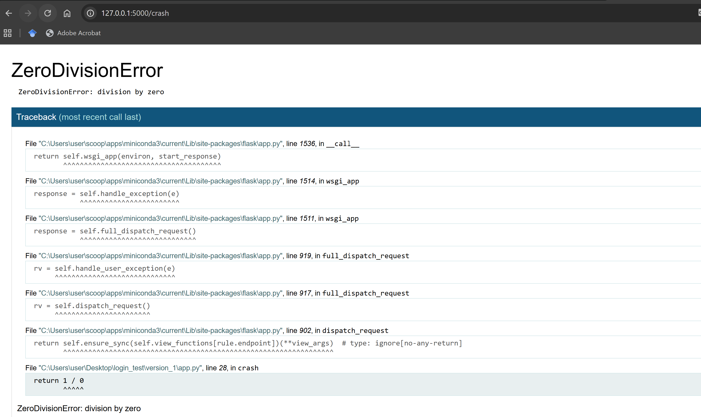
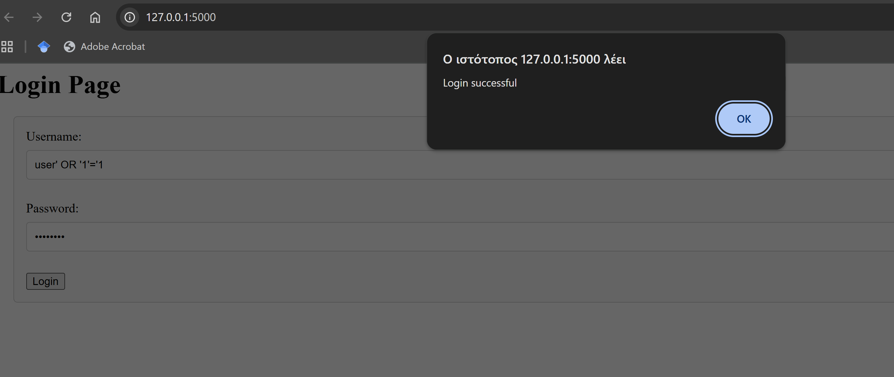
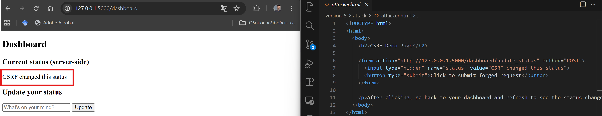

## Security Login Form Evolution - A security-focused web application
### Introduction
Inspired by Hack the Box Academy module "Introduction to Web Applications", this project demonstrates the evolution of a web application (login form) from an insecure design to a hardened, more security-aware implementation.
Each version is a more complicated one compared with the previous ones.
Rather than re-telling about well known vulnerabilities in web applications, the project follows a progressive security model, where each version introduces or exposes a specific class of vulnerability. These vulnerabilities are then analyzed and mitigated in later version, leading to a final protected implementation.

The goal of this project is educational: to undertand why vulnerabilities occur, how they are exploited and how proper security controls can prevent them.

### Project philosophy
Modern web vulnerabilities are usually a result of:
naive design solutions.
misplaced trust in client-side.
misunderstand of different web security layers.

This project was intentionally built by:
Starting with naive implementations.
Analyzing their weaknesses.
Incrementally increasing application complexity.
Applying security controls as understanding deepened.

### Threat Model

This project assumes:
- An attacker with network access to the application
- No prior authentication (unless explicitly stated)
- Ability to host malicious HTML pages (CSRF)
- Ability to control client-side input

### Progression
Each folder(version_0 -> version_protected) includes a total functional version of a login form.
In each version, we introduce specific vulnerabilities and fixes.

#### Version 0 - Client-Side Fake Authentication
Authentication exists only in client-side.
Dummy implementation which is not used in real life implementations.

Security vulnerabilities: Insecure design (client-side logic is accessible from everyone), Authentication failures (hard-coded credentials in client-side).

#### Version 1 - Server Side Authentication
Authentication moved to the back-end (Client ---> Login in frontend {username, password} ---> JS request to Flask web server ---> Validation ---> Response success/failure).
Still no database or proper identity management.
Bad design of JSON responses from web server which can leak sensitive information.
Debug mode is ON in Flask web server, very dangerous for production systems.

Security vulnerabilities: No brute-force protection (/login endpoint can crash), security misconfigurations (debug mode ON), Insecure design (even if authentication is server-side, JSON responses can leak sensitive information, hard-coded credentials server-side)

For example, with debug mode ON malicious actors can extract valuable information from the error logs in the browser:

#### Version 2 - SQL injection
Credentials stored in a SQLite instance.
Hashed passwords are stored in database.
Generic error messages added (no leakage of sensitive information), hard-coded credentials removed.

Security vulnerabilities: SQL injection caused by insecure query extraction. User's inputs are not well parsed before they are passed into DB. This leads to the specific vulnerability, where user's input is not handled as data but as code. Through this vulnerability , users can bypass username authentication as illustrated below by manipulating the DB to always return TRUE while searching for the user's name.In the secure implementation, the SQL query is parsed before user input is bound. As a result, injected characters such as quotes or SQL operators lose their special meaning and are treated strictly as data.

#### Version 3 - Authentication vs Authorization
Session-based authentication is introduced.
Missing authorization checks in protected routes.
/logout endpoint is also implemented to invalidate the session by clearing server-side session data.

Authentication verifies a user’s identity during login, while authorization determines what actions or resources an authenticated user is allowed to access.
After successful authentication, the server creates a session representing the authenticated user.
A session cookie is stored in the user’s browser and automatically sent with each request. This allows the server to identify the user and retrieve trusted session data.
Authorization decisions are then enforced server-side by checking session attributes, such as the user’s identity, before granting access to protected resources.

Security vulnerabilities: Broken Access Control (vulnerable endpoint with no proper validation of session user state can be accessed from non authenticated users)

#### Version 4 - Cross-Site Scripting
User can update his/her status in /dashboard endpoint after successful login.

Security vulnerabilities: DOM-based XSS vulnerability is a client-side vulnerability that allows malicious actors to inject executable code into a web application, which is then executed in the victim’s browser. The vulnerability arises because user-controlled input is inserted into the DOM using innerHTML, which causes the browser to interpret the input as HTML rather than plain text. As a result, any markup or script-like content provided by the user is parsed and rendered by the browser. In order to mitigate this issue, we change innerHTML to TextContent.

Both XSS and SQL injection are caused by improper handling of untrusted input, where user-supplied data is processed as executable code instead of being treated as data. However, they occur in different layers, as SQL injection targets the backend database while DOM-based XSS affects the browser.

#### Version 5 - Cross-Site Request Forgery (CSRF)
A state-changing endpoint (`/dashboard/update_status`) is introduced. The endpoint intentionally authorizes users solely based on the presence or not of a session cookie. An attacker-controlled page (`attack/attacker.html`) attempts to trigger a cross-site post request. The malicious script takes advantage of the user's session cookie stored in browser and successfully change the status preview in `/dashboard` endpoint without the user's intent.

Security vulnerabilities: Cross-Site Request Forgery (CSRF). A user can be tricked and visit the `attacker.html` page. Then if he gets tricked and clicks the button in this page, a malicious actor can try to send a post request to the login form, taking advantage of the authenticated user. We have to clarify that CSRF attacks are highly stealthy and they can remain silent for a long time.

Some secuirity good practices can be adopted in order to mitigate this issue. CSRF tokens, SameSite cookie policy (common to modern browsers) and strict content policy can be introduced in order to provide additional security depth to our web application.

#### Final Protected Version – Hardened Implementation

The final version addresses all vulnerabilities introduced throughout the project by applying common security best practices:

- Parameterized SQL queries  
- Password hashing  
- Session-based authentication with proper authorization checks  
- XSS-safe rendering (no unsafe DOM insertion)  
- CSRF protection using server-side tokens  
- Debug mode disabled and safer defaults applied  

This results in a **minimal but securely designed web application**.

---

### OWASP Top 10 Mapping

| Version | Vulnerability | OWASP Category |
|------|--------------|----------------|
| v0 | Client-side auth | A04: Insecure Design |
| v1 | Debug mode leakage | A05: Security Misconfiguration |
| v2 | SQL Injection | A03: Injection |
| v3 | Missing authorization | A01: Broken Access Control |
| v4 | DOM XSS | A03: Injection |
| v5 | CSRF | A01: Broken Access Control |

### Conclusion

This project is not merely a retelling of well-known vulnerabilities.  
It is designed for educational purposes and demonstrates:

1. Naive design decisions  
2. Vulnerability discovery and security analysis  
3. Partial fixes with progressive complexity  
4. Deeper understanding of web security layers  
5. A final hardened implementation using defense-in-depth  

---

### How to Run

1. Navigate to the folder containing the desired version  
2. Initialize the database if required: `python init_db.py`
3. Run Flask web server `python app.py`
4. Visit `http://localhost:<port>`
